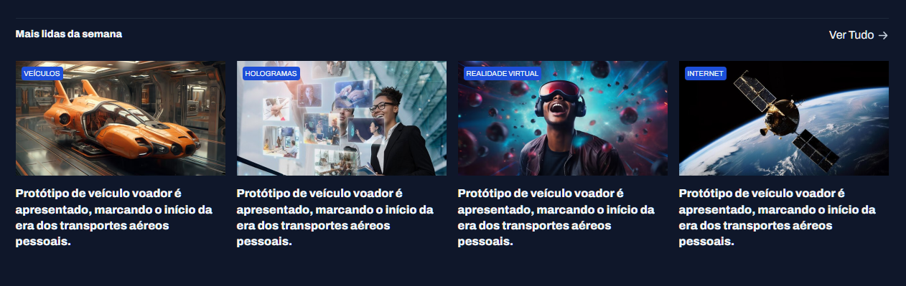
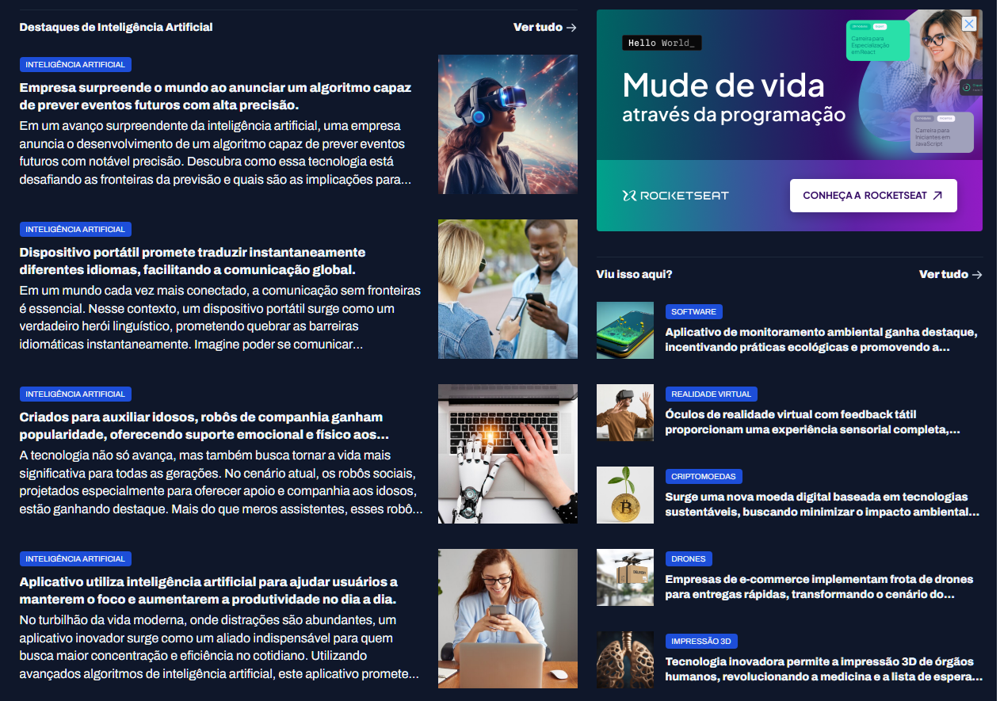

# Portal de Notícias 📰

Um portal moderno de notícias focado em tecnologia, apresentando as últimas novidades em Inteligência Artificial, Blockchain, Hologramas, Internet, Vestíveis, Realidade Aumentada e Realidade Virtual.

## 🚀 Sobre o Projeto

Este é um portal de notícias responsivo desenvolvido com HTML5 e CSS3, apresentando um design moderno e intuitivo para consumo de conteúdo tecnológico. O site oferece uma experiência de navegação fluida com seções organizadas para diferentes categorias de notícias.

## ✨ Funcionalidades

- **Design Responsivo**: Interface adaptável para diferentes dispositivos
- **Navegação Intuitiva**: Menu principal e secundário para fácil acesso às categorias
- **Seções Organizadas**:
  - Destaques principais
  - Mais lidas da semana
  - Destaques de Inteligência Artificial
  - Seção "Viu isso aqui?" com notícias adicionais
- **Categorias Diversas**: Cobertura completa de tecnologias emergentes
- **Interface Moderna**: Design clean com tipografia Archivo

## 🛠️ Tecnologias Utilizadas

- **HTML5**: Estrutura semântica do conteúdo
- **CSS3**: Estilização e layout responsivo
- **Google Fonts**: Tipografia Archivo
- **Assets**: Ícones SVG e imagens otimizadas

## 📁 Estrutura do Projeto

```
portal-de-noticias/
├── assets/
│   ├── icons/          # Ícones SVG
│   └── img/            # Imagens das notícias
├── styles/
│   ├── global.css      # Estilos globais
│   ├── header.css      # Estilos do cabeçalho
│   ├── index.css       # Estilos principais
│   ├── destaques.css   # Estilos da seção destaques
│   ├── destaques-ia.css # Estilos dos destaques de IA
│   └── mais-lidos.css  # Estilos da seção mais lidos
├── index.html          # Página principal
└── README.md           # Documentação
```

## 🎯 Categorias de Notícias

- **Inteligência Artificial**: Algoritmos, robótica e automação
- **Blockchain**: Criptomoedas e tecnologias distribuídas
- **Hologramas**: Projeções 3D e displays avançados
- **Internet**: Conectividade e redes (6G, IoT)
- **Vestíveis**: Dispositivos wearables e monitoramento
- **Realidade Aumentada**: Experiências AR
- **Realidade Virtual**: Imersão e aplicações VR

## 🚀 Como Executar

1. Clone o repositório:

```bash
git clone [url-do-repositorio]
```

2. Navegue até o diretório:

```bash
cd portal-de-noticias
```

3. Abra o arquivo `index.html` em seu navegador preferido ou use um servidor local:

```bash
# Usando Python
python -m http.server 8000

# Usando Node.js (http-server)
npx http-server

# Usando PHP
php -S localhost:8000
```

## 📱 Screenshots

### Desktop


_Visualização da página principal em desktop_


_Seção de destaques principais_


_Seção especializada em Inteligência Artificial_

### Mobile


_Visualização responsiva em dispositivos móveis_


_Menu de navegação em dispositivos móveis_

### Tablet


_Layout adaptado para tablets_

> **Nota**: Para adicionar as screenshots, crie uma pasta `screenshots/` na raiz do projeto e adicione as imagens correspondentes.

## 🎨 Design System

### Cores

- **Primária**: Tons de azul para links e destaques
- **Secundária**: Cinza para textos e backgrounds
- **Accent**: Cores específicas para tags de categoria

### Tipografia

- **Fonte Principal**: Archivo (Google Fonts)
- **Pesos**: 100-900 (regular e itálico)

### Layout

- **Container**: Largura máxima responsiva
- **Grid**: Layout flexível para diferentes seções
- **Spacing**: Sistema consistente de espaçamentos

## 🔧 Personalização

Para personalizar o portal:

1. **Cores**: Edite as variáveis CSS em `styles/global.css`
2. **Tipografia**: Altere as importações de fonte no `index.html`
3. **Layout**: Modifique os estilos específicos em cada arquivo CSS
4. **Conteúdo**: Atualize as notícias diretamente no `index.html`

## 📈 Melhorias Futuras

- [ ] Implementação de JavaScript para interatividade
- [ ] Sistema de busca funcional
- [ ] Integração com APIs de notícias
- [ ] Sistema de comentários
- [ ] Newsletter e notificações
- [ ] Modo escuro/claro
- [ ] PWA (Progressive Web App)

## 🤝 Contribuição

Contribuições são bem-vindas! Para contribuir:

1. Faça um fork do projeto
2. Crie uma branch para sua feature (`git checkout -b feature/AmazingFeature`)
3. Commit suas mudanças (`git commit -m 'Add some AmazingFeature'`)
4. Push para a branch (`git push origin feature/AmazingFeature`)
5. Abra um Pull Request

## 📄 Licença

Este projeto está sob a licença MIT. Veja o arquivo `LICENSE` para mais detalhes.

## 📞 Contato

- **Desenvolvedor**: [Seu Nome]
- **Email**: [seu-email@exemplo.com]
- **LinkedIn**: [seu-linkedin]
- **Portfolio**: [seu-portfolio.com]

---

⭐ Se este projeto foi útil para você, considere dar uma estrela no repositório!
